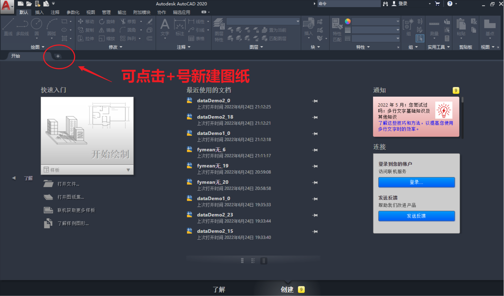
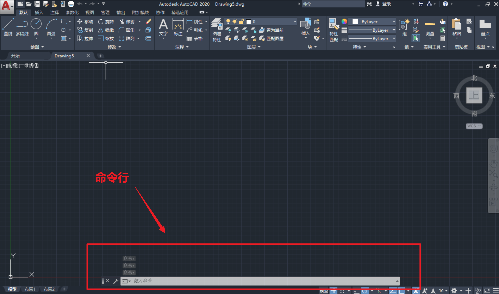
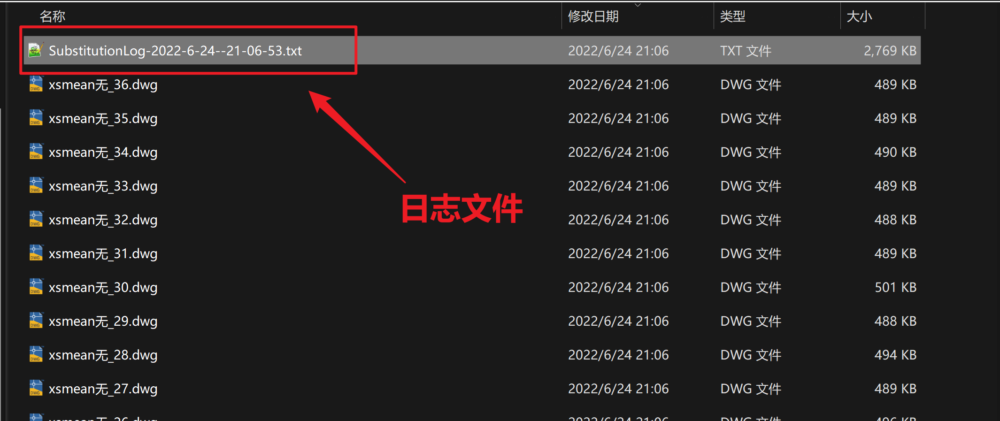
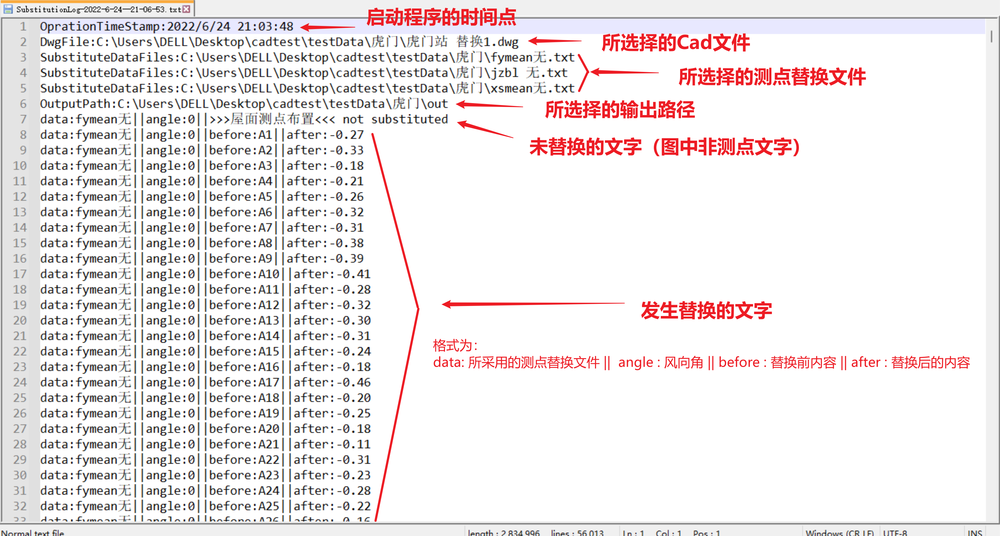

# 使用说明

## 操作方法

1. 打开Cad软件

1. 在命令行中输入`netload`回车，在弹出对话框中选择`cad-point-substituter-net.dll`文件，点击打开，再点击`始终加载`或`加载一次`

   * 没有命令行可新建一个图纸，下方即出现命令行：

     

     命令行位置如下：

     

1. 在命令行中输入`submp`，回车

1. 选择要替换测点的Cad文件

1. 选择测点替换数据文件（可选择多个测点替换数据文件，会依次进行替换，每个替换文件的风向角个数可以不同）

1. 选择输出文件夹

1. 等待程序替换

1. 替换完成后，结果文件生成于所指定的文件夹中，以`测点替换文件名_风向角`命名

## 注意事项

1. 需依赖Cad软件运行，目前测试Win11-Cad2020，win10-Cad2020、Win10-Cad2018可用

1. 待替换的测点号需使用单行文字

1. 运行过程中不要操作Cad，也不要用此Cad打开其他文件

1. 程序运行结束后会在输出文件夹生成一个以时间命名的日志文件，记录了替换信息

   

   
